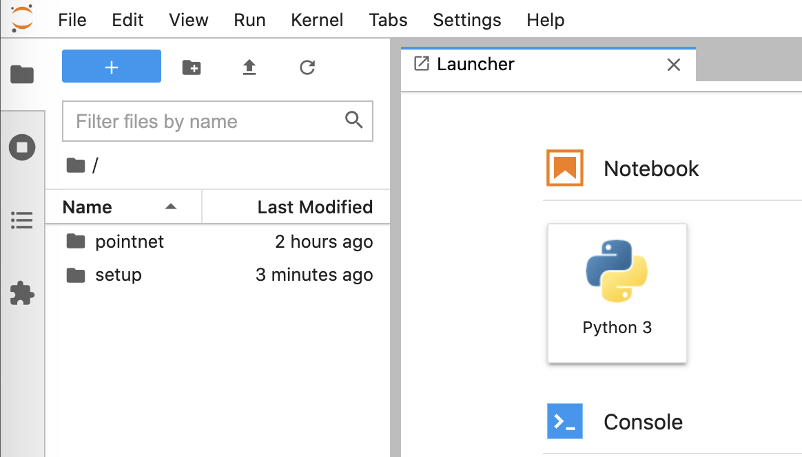

## 0. Connect to Kcloud with kvpn
You need to turn **Kcloud VPN** on to connect to Kcloud.

Please refer to the link below for more details.

[Kcloud connection Instruction](https://kcloud.kaist.ac.kr/index.php/board/?uid=141&mod=document&pageid=1#kboard-document)

You might have to turn on another VPN, __KVPN__ as well _when you are outside the campus._

[KAIST VPN Service](https://kvpn.kaist.ac.kr/dana-na/auth/url_ZdZaEjNTN0dKCA02/welcome.cgi)

Run the following command and copy and paste an initial password:
```
ssh root@{VM_NAT_IP}
```

For those who are using Windows and haven't used ssh, please follow the guideline below:

[How to use SSH in Windows](https://www.howtogeek.com/336775/how-to-enable-and-use-windows-10s-built-in-ssh-commands/)

## 1. Install cuda-toolkits
Open a terminal in the Kcloud VM.

Run:
```
git clone https://github.com/63days/kaist-3dml-assignments assignments
cd assignments/setup
./install_cuda.sh
```
You will get logged out with reboot. Wait for a minitue and re-connect to the Kcloud.
When you type `nvidia-smi` and `nvcc -V`, you should be able to see the outputs below.
- `nvidia-smi`
```
+-----------------------------------------------------------------------------+
| NVIDIA-SMI 470.103.01   Driver Version: 470.103.01   CUDA Version: 11.4     |
|-------------------------------+----------------------+----------------------+
| GPU  Name        Persistence-M| Bus-Id        Disp.A | Volatile Uncorr. ECC |
| Fan  Temp  Perf  Pwr:Usage/Cap|         Memory-Usage | GPU-Util  Compute M. |
|                               |                      |               MIG M. |
|===============================+======================+======================|
|   0  NVIDIA GeForce ...  Off  | 00000000:00:06.0 Off |                  N/A |
| 30%   36C    P0    88W / 350W |      0MiB / 24268MiB |      0%      Default |
|                               |                      |                  N/A |
+-------------------------------+----------------------+----------------------+

+-----------------------------------------------------------------------------+
| Processes:                                                                  |
|  GPU   GI   CI        PID   Type   Process name                  GPU Memory |
|        ID   ID                                                   Usage      |
|=============================================================================|
|  No running processes found                                                 |
+-----------------------------------------------------------------------------+
```
- `nvcc -V`
```
nvcc: NVIDIA (R) Cuda compiler driver
Copyright (c) 2005-2020 NVIDIA Corporation
Built on Tue_Sep_15_19:10:02_PDT_2020
Cuda compilation tools, release 11.1, V11.1.74
Build cuda_11.1.TC455_06.29069683_0
```

## 2. Install libraries.
Move to `assignments/setup` again, and install some libraries.

It would take some time. (about 5~10m)
```
cd assignments/setup
./install_essential.sh
```
Check whether you see the following output:
```
1.9.0+cu111
True
tensor(1.2854, device='cuda:0')
```
If you can't see `(venv)` in front of your account name like this: `(venv) root@cs492a-1:~#`, activate virtualenv by hand:
```
source ~/venv/bin/activate
```
You should activate `venv` environement since all python libraries were installed in `venv` through the script.

## 3. Start JupyterLab
Run:
```
jupyter notebook --generate-config
jupyter lab --port={PORT_NUM} --allow-root
```
Use `4000+ (the last two digits of your VM ID)` as your `{PORT_NUM}`. If the last two digits of your VM ID is `01`, run:
```
jupyter lab --port=4001 --allow-root
```
At the end of the output message, you'll see a webpage address starting like this:
```
https://127.0.0.1:4001/lab?token=
```
Copy the entire address including the token.

Open another terminal and login to KCLOUD like this:
```
ssh -N -f -L {PORT_NUM}:localhost:{PORT_NUM} root@{VM_NAT_IP}
```
Open a web browser, and go to the link you copied. You should be able to see a screen like this:


Now all setup for the assignments has finished. 

Move to `pointnet` directory and follow the `REAMD.md` there.

Please DM me (Juil Koo) via Discord if you get stuck while following this instruction.
